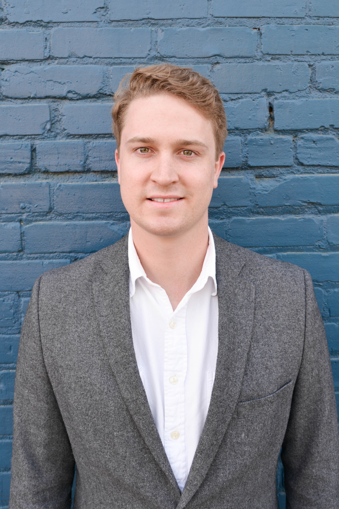

# Robert "Parker" Ellwanger
## Automation Test And System Engineer @ NVIDIA

    

---

I am currently pursuing my Masters of Computer Science at the University Of Illinois Urbana Champaign, concurrently working as an Automation System and Test Engineer.

### About Me

I am passionate about programming and perpetual learning, striving for continuous improvement in both my professional and academic endeavors. My current focus lies in the intersection of automation tools and computer vision, particularly within the domain of autonomous vehicles.

### Interests

- **Automation Tools:** I am fascinated by the efficiency and reliability that automation brings to various processes and systems.
  
- **Computer Vision:** Exploring the vast possibilities of computer vision technology excites me, especially its applications in real-world scenarios.
  
- **Autonomous Vehicles:** The fusion of automation and computer vision in autonomous vehicles presents endless opportunities for innovation and societal impact.

### Continuous Learning

I am committed to staying abreast of new technologies and applications through a blend of formal education and self-directed learning initiatives. My journey in academia and industry has fueled my curiosity, driving me to explore emerging trends and push the boundaries of my knowledge.

### Explore Further

Feel free to browse through this site to discover more about my background, explore my resume, and delve into some of the projects I am eager to showcase.

---
